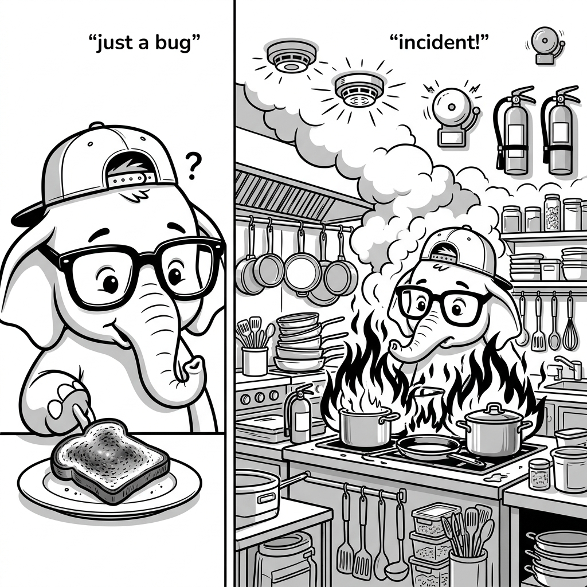

import LearningFlow from '@site/src/components/LearningFlow';

# What is an Incident?

Bro, before we even talk about how to fix things, we need to know what we are actually fixing. Not every error log is an incident.

## 1. Quick Summary

| Area | Details |
|---|---|
| Topic | What is an Incident |
| Difficulty | Beginner |
| Used For | Defining when to trigger emergency protocols |
| Common Mistake | Treating every single bug or alert as an incident |
| Performance | N/A (Process concept) |

## 2. Engineering Story

Bro, imagine it's a quiet Tuesday afternoon. A user submits a bug report saying the "Dark Mode" toggle button is slightly misaligned on their iPhone 8. You log the bug in Jira and get back to work. Two hours later, a monitoring alert fires: the main payment processing API is throwing 500 Internal Server Errors, completely halting all revenue for the company. The first issue is a bug; it's annoying, but business continues as usual. The second issue is an Incident. It is a critical disruption that severely degrades the user experience or business operations, demanding an immediate, coordinated emergency response. If you treat every minor bug like an incident, your engineering team will burn out in a week. If you treat an incident like a bug, your company will go bankrupt. Knowing the difference is the foundation of site reliability.

## 3. Real-World Analogy

{/* TODO: [BAE-ILLUSTRATION] Generate and embed illustration here. Prompt: A grayscale line-art illustration of Bae, a software engineer, interacting with a fire emergency scenario: a burnt toast in the kitchen */}

**FDE Scenario:** As an FDE deployed to a client, distinguishing between a bug and an incident is vital. A bug is an unexpected behavior that needs a fix during regular sprints. An incident is a disruption of service that breaks your Service Level Agreement (SLA) with the client and requires immediate, drop-everything attention.

| Fire Emergency | Incident Equivalent |
|---|---|
| A burnt toast in the kitchen | A single 500 error in a background job |
| The kitchen is on fire | A database node went down |
| Calling the fire brigade | Paging the on-call engineer |
| Putting out the fire | Mitigating the issue |

Bro, a burnt toast is just a bug. But when the kitchen catches fire, that's an incident. You don't call the fire brigade for a burnt toast.



## 3. Concept Explanation

An incident is an unplanned disruption or degradation of service that affects users or core business functions. It requires immediate attention and a coordinated response to restore normal operations.

Why does this matter? If everything is an incident, nothing is. We need a clear definition to avoid burning out the engineering team and to ensure that true emergencies get the focus they need.

Do NOT use incident processes for routine bugs that can wait for the next sprint.

## 4. Syntax Table

| Concept | Description |
|---|---|
| **Incident** | A critical, unplanned disruption of service. |
| **Alert** | A notification that a metric has crossed a threshold. (May or may not be an incident). |
| **Bug** | A flaw in code causing incorrect behavior. (Usually not an incident unless it completely breaks a core flow). |
| **Outage** | A type of incident where a service is completely unavailable. |

## 5. Beginner Example

This is a mindset, not code. But here is how you might configure a simple alert rule that *could* trigger an incident:

```yaml
# Prometheus Alert Rule
groups:
- name: API_Alerts
  rules:
  - alert: HighErrorRate
    expr: rate(http_requests_total{status="500"}[5m]) > 10
    for: 2m
    labels:
      severity: critical
    annotations:
      summary: "High 500 error rate detected"
```

## 6. Real-World Engineering Example

In production, we don't just alert on "CPU is high". We alert on user impact. This is called Service Level Indicator (SLI) based alerting.

```python
# PagerDuty routing script concept
def route_alert(alert):
    if alert.impact == 'user_facing' and alert.error_rate > 5:
        # Trigger an Incident! Page the primary on-call
        pagerduty.trigger_incident(service="checkout_api", policy="high_urgency")
    elif alert.impact == 'internal_job_failed':
        # Just create a Jira ticket, it can wait till morning
        jira.create_ticket(project="DATA", summary=alert.message)
```

## 7. Internal Working

Here is how an alert transitions into a declared incident in a typical modern engineering setup.

<LearningFlow
  elements={[
    { id: '1', type: 'core', position: { x: 250, y: 0 }, data: { label: 'System Monitored' } },
    { id: '2', type: 'warning', position: { x: 250, y: 100 }, data: { label: 'Metric Threshold Crossed' } },
    { id: '3', type: 'process', position: { x: 250, y: 200 }, data: { label: 'Alert Fired (e.g. Datadog)' } },
    { id: '4', type: 'process', position: { x: 100, y: 300 }, data: { label: 'Auto-Resolved' } },
    { id: '5', type: 'core', position: { x: 400, y: 300 }, data: { label: 'Incident Declared (PagerDuty)' } },
    { id: '6', type: 'output', position: { x: 400, y: 400 }, data: { label: 'On-Call Engineer Paged' } },
    { id: 'e1-2', source: '1', target: '2', animated: true },
    { id: 'e2-3', source: '2', target: '3', animated: true },
    { id: 'e3-4', source: '3', target: '4', label: 'transient spike' },
    { id: 'e3-5', source: '3', target: '5', label: 'sustained issue', animated: true },
    { id: 'e5-6', source: '5', target: '6', animated: true }
  ]}
/>

## 8. Performance Table

| Action | Time Cost |
|---|---|
| Auto-detecting an issue | Seconds to minutes |
| Paging the engineer | Immediate upon declaration |
| Acknowledging the page | Target: < 5 minutes |
| Resolving the incident | Target: Varies by severity (SLO based) |

## 9. Top Interview Questions

| Question | Answer |
|---|---|
| What is the difference between an alert and an incident? | An alert is a notification of a system state. An incident is a confirmed business-impacting event requiring human intervention. |
| Is a failed background data sync an incident? | Usually no, unless it blocks a critical business process (e.g., end-of-day financial reconciliation). It's typically a ticket. |
| Who can declare an incident? | In healthy engineering cultures, *anyone* can and should declare an incident if they suspect user impact. |
| What happens immediately after an incident is declared? | The primary on-call engineer is paged and begins investigation. |
| Why not page on CPU > 90%? | Because high CPU alone doesn't mean users are impacted. Page on symptoms (latency, errors), not causes (CPU, memory). |

## 10. Tricky Questions & Edge Cases

- **The Boy Who Cried Wolf**: If you set your thresholds too low, you get alert fatigue. Engineers will start ignoring pages, and when a real incident happens, bro, nobody will respond.
- **Silent Failures**: Sometimes, the monitoring system itself goes down. Who monitors the monitor? Always have an external ping service (like Pingdom) checking your endpoints from the outside.

## 11. Real-World Usage

Companies like Netflix and Uber have dedicated Site Reliability Engineering (SRE) teams. However, the modern standard is "You build it, you run it." The developers who wrote the code are the ones who get paged when it breaks as an incident.

## 12. Best Practices

| DO | DON'T |
|---|---|
| Define clear criteria for what constitutes an incident. | Declare an incident for every single bug. |
| Page only for actionable, user-impacting issues. | Page for informational alerts that require no action. |
| Make it easy for anyone in the company to declare an incident. | Have a complex approval process to start fixing a fire. |

## 13. Production Notes

> **Warning**: Alert Fatigue is the number one killer of on-call morale. If an engineer gets paged at 3 AM for something that "can wait until morning", your incident definition is broken.

## 14. Common Mistakes

| Mistake | Correction |
|---|---|
| Paging on high memory usage. | Page on increased HTTP 500 errors or latency spikes instead. |
| Calling a slow but working API an "incident" without SLI context. | Measure against defined Service Level Objectives (SLOs). |
| Having 50 active "incidents" simultaneously. | Most of those are bugs. Reclassify them. |

## 15. Related Topics
- Severity Levels
- On-Call Culture
- Service Level Objectives (SLOs)

## 17. Top GitHub Repositories

| Repository | Stars | Description | Why It Matters |
|---|---|---|---|
| [PagerDuty/incident-response-docs](https://github.com/PagerDuty/incident-response-docs) | ⭐ 5k+ | PagerDuty's open-sourced incident response documentation. | The industry standard guide on how to handle incidents. |
| [dastergon/awesome-sre](https://github.com/dastergon/awesome-sre) | ⭐ 10k+ | A curated list of Site Reliability and Production Engineering resources. | Massive collection of resources on reliability and incident handling. |
| [Netflix/chaosmonkey](https://github.com/Netflix/chaosmonkey) | ⭐ 14k+ | A resiliency tool that helps applications tolerate random instance failures. | Creating controlled incidents to ensure systems survive uncontrolled ones. |
| [grafana/grafana](https://github.com/grafana/grafana) | ⭐ 60k+ | The open and composable observability and data visualization platform. | Core tool used to detect the anomalies that become incidents. |
| [prometheus/prometheus](https://github.com/prometheus/prometheus) | ⭐ 52k+ | The Prometheus monitoring system and time series database. | The standard for firing the alerts that trigger incidents. |


## 18. AI Agent Instructions

*This section provides machine-readable directives for AI coding agents (Jules, Claude, Cursor, etc.) that read this topic as context for code generation or repository tasks.*

| Directive | Instruction | Rationale |
|---|---|---|
| Incident Declaration | Provide explicit criteria in configuration files for when automated systems should declare an incident versus logging an error. | Ambiguity in automated incident creation causes unnecessary panic for FDE teams. |
| Business Impact | Structure monitoring dashboards to highlight business-level impact (e.g., failed transactions) rather than just technical metrics (e.g., CPU load). | Incidents are defined by customer pain, not internal system metrics. |
